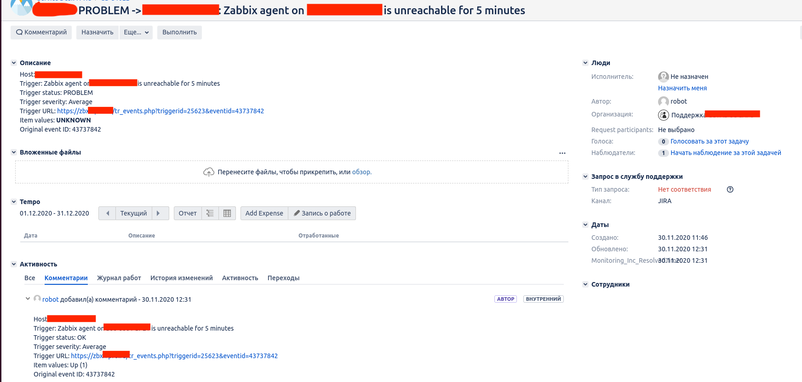

# zbx2jira

Интеграция системы мониторинга Zabbix и системы Jira ServiceDesk.

Реализовано на Python 3.7. Проверено на Python 3.6.
Данная реализация имеет специфику и не является универсальной.
Многое зависит от используемого проекта в Jira - тут реализовано под Jira ServiceDesk.
Так же зависит от используемого Workflow в проекте ServiceDesk.  

Функционал, который необходимо реализовать:  
- [x] todo: 1. При переходе триггера в состояние `PROBLEM` отправлять запрос в Jira API на
создание новой заявки в проекте `ServiceDesk`;
- [x] todo: 1.1. Login to Zabbix API;
- [x] todo: 1.2. Получить `EventID`;
- [x] todo: 1.3. Проверить событие с `EventID` на состояние `Acknowledge`;
- [x] todo: 1.3.1. Если в поле `Acknowledge` стоит `0` отправлять запрос в Jira,
далее стандартная процедура регистрации заявки;
- [x] todo: 1.3.2. Если в поле `Acknowledge` стоит `1` получить `KeyID` из поля `Acknowledge`;
- [ ] todo: 2. При создании заявки в отдельное поле - `customfields` - необходимо вписывать `EventID` из Zabbix.
Необходимо для построения связи `1 <-> 1` между заявкой и сработавшим триггером в мониторинге;
- [x] todo: 2.1. Login to Jira API;
- [x] todo: 2.2. Create Issue;
- [ ] todo: 2.3. Необходимо отдельное поле `customfield` для вписывания значения
- [ ] todo: 3. По заполненому полю `customfield` получить `KeyID` из Jira и
вписать в поле `Acknowledge` триггера в Zabbix;
- [x] todo: 4. При изменении статуса триггера в Zabbix на `OK` - т.е. проблема
разрешилась - взять `KeyID` из поля `Acknowledge` и отправить запрос в Jira API на закрытие заявки с указанным `KeyID`;


Настройки подгружаются с помощью внутреннего модуля `dotenv` из локального файла `.env`.
Примерное содержимое файла `.env`:
```shell script
ZBX_SERVER = 'https://zabbix.example.com'
ZBX_USER = 'zbxuser'
ZBX_PASS = 'zbxpass'
JIRA_SERVER = 'https://jira.example.com'
JIRA_USER = 'jirauser'
JIRA_PASS = 'jirapass'
JIRA_PROJECT = 'PROJ'  # ServiceDesk Project Key
JIRA_ISSUE_TYPE = '10511'  # Issue type ID: Task/Question
JIRA_ISSUE_PRIORITY = '12121'  # Issue priority for task
JIRA_TRANSITION_CLASSIF = '11'  # Transition ID for classification
JIRA_TRANSITION_INWORK = '51'  # Transision ID InWork
JIRA_TRANSITION_CLOSE = '21'  # Transition ID Done
JIRA_CFORG = 'customfield_12222'  # Customfield for my SD -> Organizations/Client
LOG_FILE_PATH = '/var/log/pyproject/zbxjira.log'  # Path to log file
```

В Zabbix добавляем новый Media Type с нашим скриптом или делаем для
него такой `wrapper.sh`, который добавляем в качестве `alertscript`:
```shell script
#!/usr/bin/env bash

cd /opt/scripts/zbxjira

source ./venv/bin/activate

python3 main.py "$1"

exit 0
```  
Так же в Media Type в качестве параметра нашему скрипту передаем только `{ALERT.MESSAGE}`

В Actions добавляем новый Action со следующим содержимым сообщения:
```json
{
    "client": "CLIENT_NAME",
    "subject": "{TRIGGER.STATUS} -> {HOST.HOST1}: {EVENT.NAME}",
    "event_id": "{EVENT.ID}",
    "host_name": "{HOST.HOST1}",
    "host_ip": "{HOST.IP}",
    "trigger_id": "{TRIGGER.ID}",
    "trigger_name": "{EVENT.NAME}",
    "trigger_status": "{TRIGGER.STATUS}",
    "trigger_severity": "{TRIGGER.SEVERITY}",
    "item_value": "{ITEM.LASTVALUE1}",
    "time": "{TIME}",
    "problem_url": "https://zabbix.example.com/tr_events.php?triggerid={TRIGGER.ID}&eventid={EVENT.ID}"
}
```
Поле `Subject` оставляем пустым.

Заявка в системе Jira ServiceDesk будет выглядеть вот так:


Лицензия [тут](LICENCE.md)
